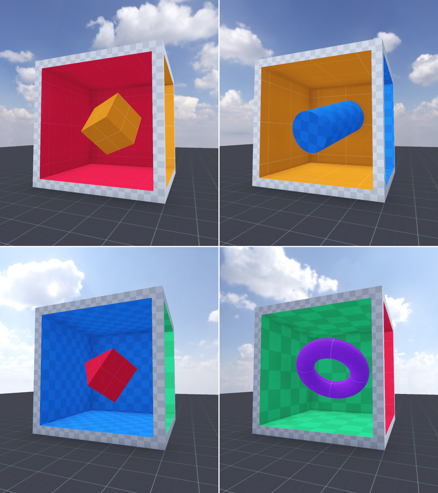
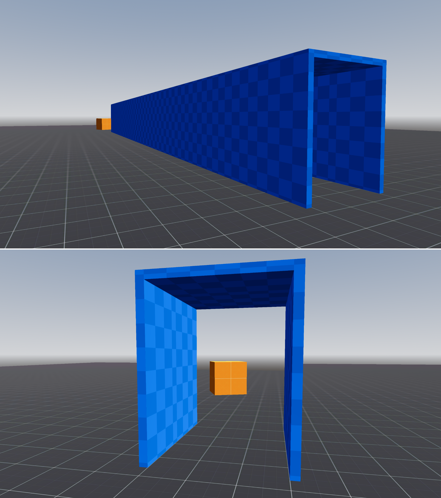
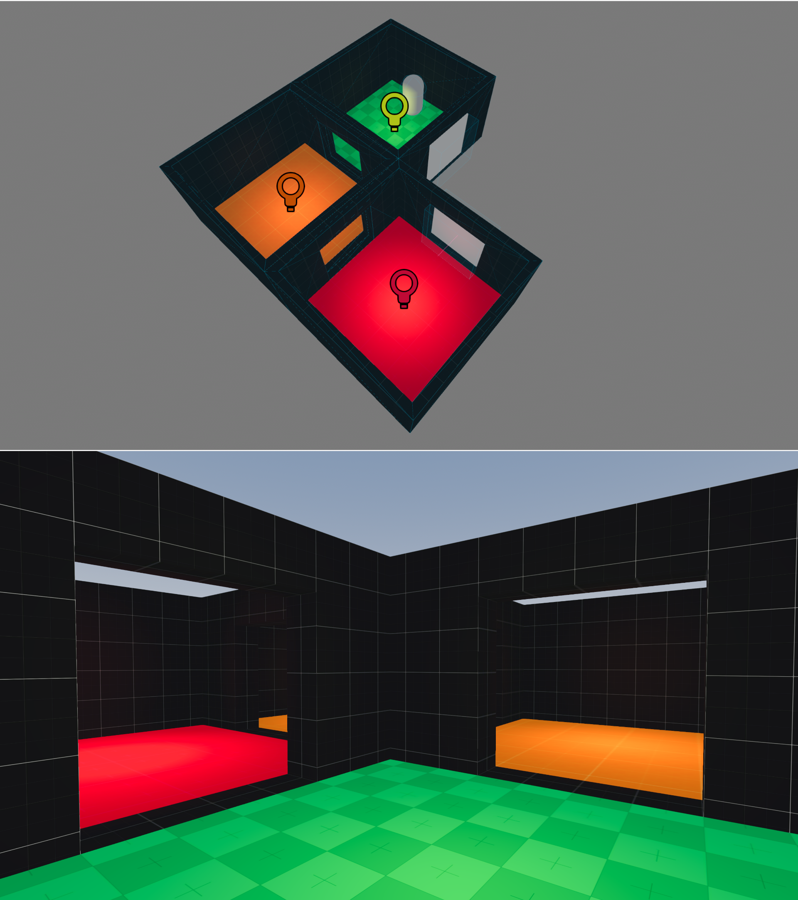
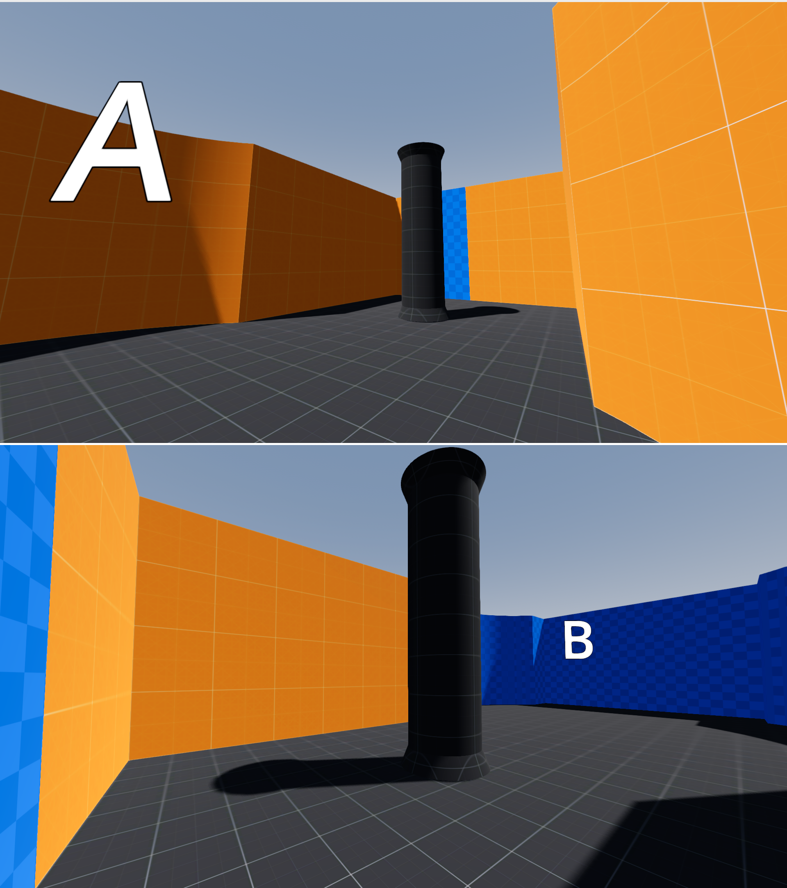

# Portals Plugin

This project provides a plugin for seamless 3D portals in Godot. It was developed as part
of my Master's thesis on FI MUNI.

## Installation

- You can download the plugin from the [Godot Asset Library](https://godotengine.org/asset-library/asset/4022)
- The plugin itself is located in the `addons/portals` directory. You can clone
this repo (or download it as a ZIP) and move the plugin folder into your own project.

## Documentation

For documentation the plugin's documentation, see [`addons/portals/README.md`](./addons/portals/README.md).

## Showcase

The project contains some simple levels, showcasing various aspects of the plugin.
Go through them to find out what's in store! You can also see some screenshots below.

Also check out the [example project](https://github.com/VojtaStruhar/antichamber-example)
where I recretated a puzzle from Antichamber.

This cube has a different inside depending on from which side you are looking at it:

This hallway is shorter on the inside than on the outside:

These three rooms form a full circle with a 90 degree angle in the middle:

A seamless portal is positioned behind the column! Going around the column transports you to an
entirely different space.

## Credits

- [Kenney prototype textures](https://www.kenney.nl/assets/prototype-textures)
- [Skybox](https://polyhaven.com/a/kloofendal_48d_partly_cloudy_puresky)
